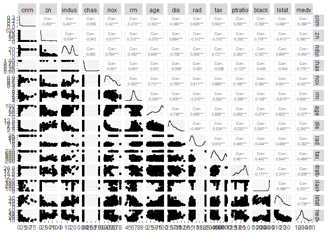
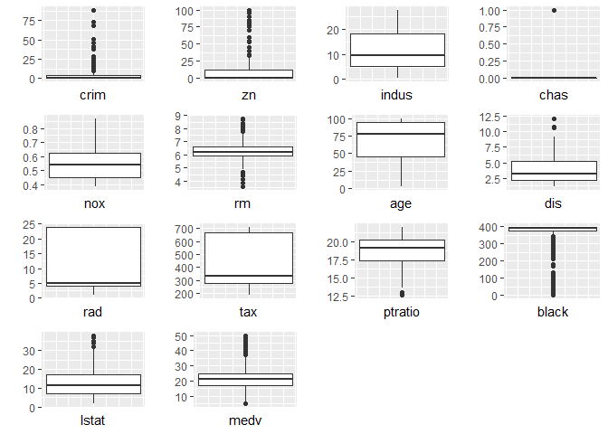
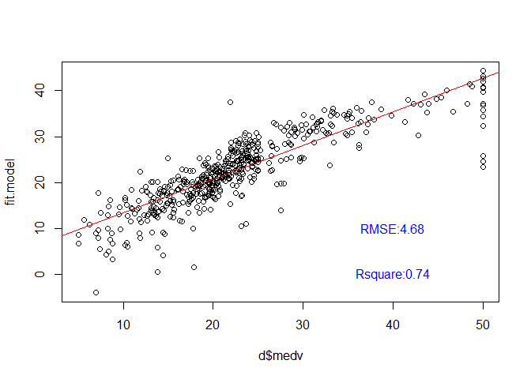
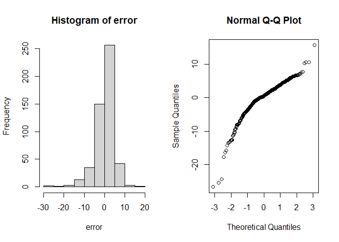
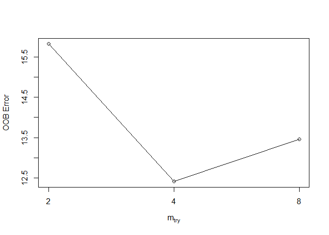
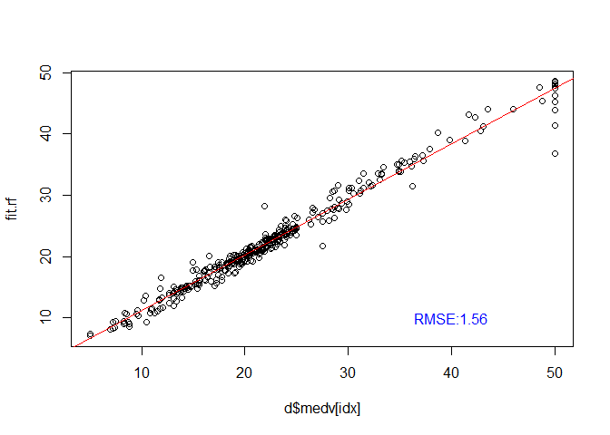
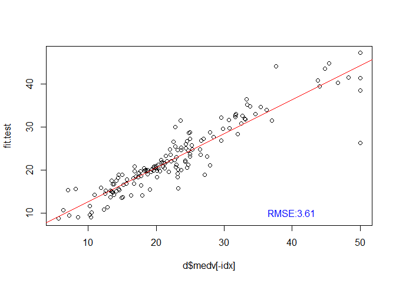
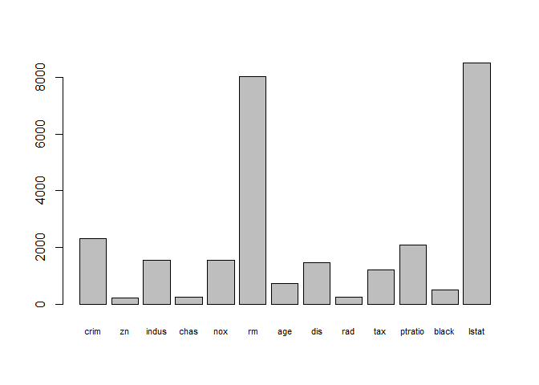
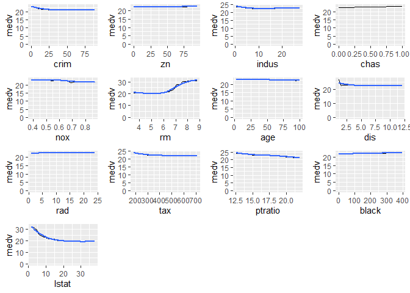
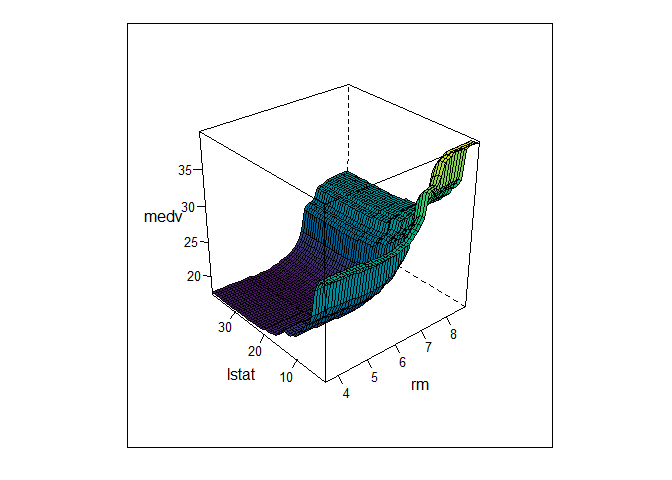

# Basic-Machine-Lerning_regression

Some simple machine learning methods for regression.

Each folder jumps to R codes showing how to execute machine learning models.
some hyper parameters in models are tuned so as to maximize their qualities.

## Regression Analysis of Boston housing dataset

This is a basic but convenient machine learning method when it comes to
regression. Here, I use Boston dataset.

``` r
library(MASS)
d <- Boston
head(d)
```

    ##      crim zn indus chas   nox    rm  age    dis rad tax ptratio  black lstat
    ## 1 0.00632 18  2.31    0 0.538 6.575 65.2 4.0900   1 296    15.3 396.90  4.98
    ## 2 0.02731  0  7.07    0 0.469 6.421 78.9 4.9671   2 242    17.8 396.90  9.14
    ## 3 0.02729  0  7.07    0 0.469 7.185 61.1 4.9671   2 242    17.8 392.83  4.03
    ## 4 0.03237  0  2.18    0 0.458 6.998 45.8 6.0622   3 222    18.7 394.63  2.94
    ## 5 0.06905  0  2.18    0 0.458 7.147 54.2 6.0622   3 222    18.7 396.90  5.33
    ## 6 0.02985  0  2.18    0 0.458 6.430 58.7 6.0622   3 222    18.7 394.12  5.21
    ##   medv
    ## 1 24.0
    ## 2 21.6
    ## 3 34.7
    ## 4 33.4
    ## 5 36.2
    ## 6 28.7

Target variable is medv.

### Exploratory Data Analysis

Before prediction, take a look at distributions of each variable and
correlation

``` r
g <- ggpairs(d,upper=list(continuous=wrap("cor",size=2)))
print(g)
```

<!-- -->

rm positevely correlates with medv though lstat, black negatively
correlate with medv. We can see multicollinearities between nox and
indus, tax and rad, age and nox and so on. Diagonal charts show
distributions. Take a look at distribution of each instance by boxplot.

``` r
gs <- map2(d,as.list(names(d)), function(x,y) ggplot(d) + geom_boxplot(aes(x)) + 
             coord_flip() + labs(x="",y=y) + theme(axis.text.x=element_blank(),
                                                axis.ticks.x=element_blank() ))
gridExtra::grid.arrange(grobs=gs)
```

<!-- -->

Considering distribution and boxplot, rm and medv seem to be normal
distribution. lstat is toward lower stats, black is concentrated in high
stats.

### Lasso

Because there were multicollinearity, simple multiple linear regression
might not be applicable but I do not have any idea which variables to
take. So use Lasso to filter variables and tune hyper parameter.

``` r
medv <- as.matrix(d[,14])
var <- as.matrix(d[,-14])
lasso.reg.cv <- cv.glmnet(x=var, y=medv,
                           nfolds = 10,
                           alpha = 1, 
                           standardize = TRUE)
bestlambda <- lasso.reg.cv$lambda.min
coef(lasso.reg.cv, s = bestlambda)
```

    ## 14 x 1 sparse Matrix of class "dgCMatrix"
    ##                        s1
    ## (Intercept)  34.248405456
    ## crim         -0.097424931
    ## zn            0.041034124
    ## indus         .          
    ## chas          2.681496880
    ## nox         -16.205420456
    ## rm            3.872832939
    ## age           .          
    ## dis          -1.386908239
    ## rad           0.248393350
    ## tax          -0.009648008
    ## ptratio      -0.928430214
    ## black         0.009000473
    ## lstat        -0.522491506

indus and age are deleted. According to coefficient, rm is the most
positive and ptratio is the most negative for 1 unit. Apply this model
to the dataset.

``` r
fit.model <- predict(lasso.reg.cv, newx = var, s = bestlambda, alpha = 1)
las <- lm(fit.model~d$medv)
las.sum <- summary(las)
R2.las <- paste("Rsquare",round(las.sum$r.squared,2),sep = ":")
rmse.las <- paste("RMSE",round(sqrt(mean((medv-fit.model)^2)),2),sep = ":")
#result plot
plot(d$medv,fit.model)
abline(las,col="red")
text(x=40,y=0,R2.las,col="blue")
text(x=40,y=10,rmse.las,col="blue")
```

<!-- -->

X axis is actual data, y axis is predicted data. Rsquare is not bad.
Then check the distribution of residual.

``` r
error <- fit.model - d$medv
par(mfcol=c(1,2))
hist(error)
qqnorm(error)
```

<!-- -->

When using Linear regression, residual (error) should followe a normal
distribution. It is difficult to insist so from this result.

### Randomforest

Let’s move on to machine learning to cope with multicollinearity. Split
the dataset into train and test, whose ratios are 0.7 and 0.3

``` r
idx <- sample(x=1:nrow(d),size = as.integer((nrow(d)*0.7)),replace = F)
d_train <- d[idx,]
d_test <- d[-idx,]
```

For hyper parameter tuning, use the mtry which minimizes error

``` r
set.seed(1111)
tune <- tuneRF(x=d_train[,-14],y=d_train[,14],plot = T,doBest = T)
```

    ## mtry = 4  OOB error = 12.41374 
    ## Searching left ...
    ## mtry = 2     OOB error = 15.81637 
    ## -0.2741027 0.05 
    ## Searching right ...
    ## mtry = 8     OOB error = 13.4654 
    ## -0.08471812 0.05

<!-- -->

Check training quality by predicting train dataset

``` r
rf <- randomForest(medv~.,data = d_train, mtry = tune$mtry)
fit.rf <- predict(rf,d_train)
rf_act <- lm(fit.rf~d$medv[idx])
rf_act.sum <- summary(rf_act)
R2.rf <- paste("Rsquare",round(rf_act.sum$r.squared,2),sep = ":")
rmse.rf <- paste("RMSE",round(sqrt(mean((d$medv[idx]-fit.rf)^2)),2),sep = ":")
#result plot
plot(d$medv[idx],fit.rf)
abline(rf_act,col="red")
text(x=40,y=0,R2.rf,col="blue")
text(x=40,y=10,rmse.rf,col="blue")
```

<!-- -->

X axis is actual data, y axis is predicted data. RMSE is way lower than
that of lasso!

What it would be for the test data?

``` r
fit.test <- predict(rf,d_test)
test_act <- lm(fit.test~d$medv[-idx])
test_act.sum <- summary(test_act)
R2.test <- paste("Rsquare",round(test_act.sum$r.squared,2),sep = ":")
rmse.test <- paste("RMSE",round(sqrt(mean((d$medv[-idx]-fit.test)^2)),2),sep = ":")
#result plot
plot(d$medv[-idx],fit.test)
abline(test_act,col="red")
text(x=40,y=0,R2.test,col="blue")
text(x=40,y=10,rmse.test,col="blue")
```

<!-- -->

Seems to be great! RMSE is still lower than lasso’s. This model can be
useful for prediction.

### interpret the model

Let’s take a deep look at this model. Check the importance.

``` r
imp <- rf$importance[,1] %>% barplot(cex.names=.7)
```

<!-- -->

``` r
print(imp)
```

    ##       [,1]
    ##  [1,]  0.7
    ##  [2,]  1.9
    ##  [3,]  3.1
    ##  [4,]  4.3
    ##  [5,]  5.5
    ##  [6,]  6.7
    ##  [7,]  7.9
    ##  [8,]  9.1
    ##  [9,] 10.3
    ## [10,] 11.5
    ## [11,] 12.7
    ## [12,] 13.9
    ## [13,] 15.1

It is obvious that rm and lstat are the most important. Surprisingly,
black is not as important as others although a correlation with medv was
relatively high. A distribution of black was biased so that might be
related with a low importance.

Importance is just an importance. Next, see dynamic relations of each
variable with medv.

``` r
# partial dependence profile
make_pdp_zero <- function(x){
  p <- rf %>% partial(pred.var=x) %>% autoplot(ylab="medv") + 
    geom_smooth(method = "loess") + ylim(c(0, NA))
  return(p)
}
pdps <- map(as.list(names(d)[-14]), ~make_pdp_zero(.))
gridExtra::grid.arrange(grobs=pdps)
```

<!-- -->

As rm and lstat change, medv changes as well. As for other variables,
medv is almost constant.

Now, we are interested in rm, lstat and medv. Take a look at all three
variables at once.

``` r
pdp_3d_lstat_rm <- rf %>% partial(pred.var=c("rm","lstat"),parallel = T) %>%
  plotPartial(zlab="medv",levelplot = F,colorkey=F,plot.pdp = F,drape=T,scale=list(arrows=F),plot.margin= unit(c(0, 0, 0, 0), "lines"))
print(pdp_3d_lstat_rm)
```

<!-- -->

You can get the ideal place with this 3d plot!
